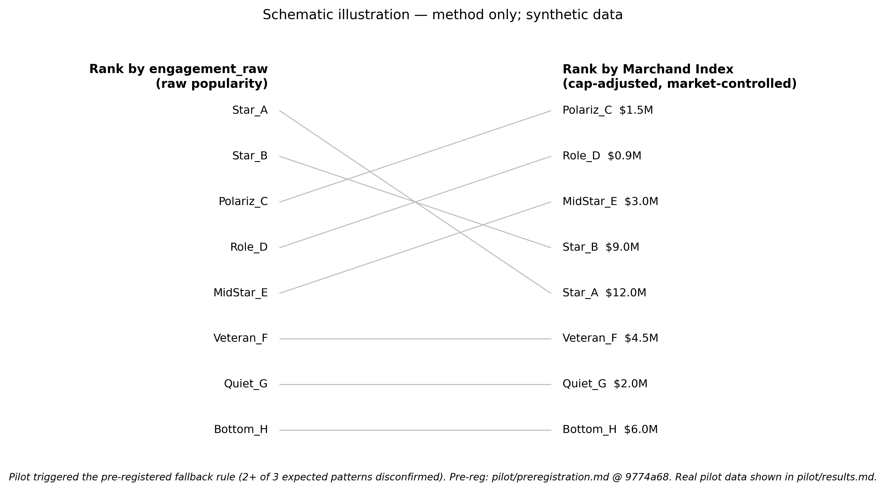

# The Marchand Index: A Cap-Adjusted Off-Ice Attention Quotient for NHL Players

**Submitted to:** Cascadia Symposium on Statistics in Sports (CASSIS), September 12, 2026. **Format requested:** Oral.

---

NHL front offices increasingly weigh off-ice fan attention — jersey sales, ticket demand, social engagement, viral moments — alongside on-ice production when valuing players, yet no public, reproducible metric isolates a player's off-ice draw from their skill. We introduce the **Off-Ice Attention Quotient (OAQ)**: each player's public-attention residual against a K=10 peer group of skill-equivalent NHLers. Cap-adjusting OAQ yields the **Marchand Index**, a per-dollar measure of off-ice value. Market amplification is controlled by reporting both raw (`OAQ_observed`) and team-baseline-stripped (`OAQ_portable`) variants. We validate the composite against three independent observable outcomes (NHL jersey list, All-Star fan vote, FA-signing event study), audit the LLM theme classifier against 300 hand-labeled comments (macro-F1 + Cohen's κ), and pre-register four hypotheses before the model is run on production data.

## 1. Motivation

Public hockey analytics has comprehensively modeled on-ice value (xG, GAR, RAPM, Corsi-family). The off-ice side — what drives merchandise, ticket, sponsorship, and viewership demand — remains effectively unmodeled in public work. Front offices ask: *which players generate fan attention beyond what their production alone predicts, and which deliver that attention efficiently relative to cap hit?* We do not claim to measure revenue; we measure **public attention as a proxy for fan demand**, validated against three observable revenue-correlated outcomes. The metric is named after Brad Marchand: a high-skill player whose public salience and polarizing identity exceed what peer-matched production predicts — the canonical case the index is built to detect.

## 2. Method

**Engagement composite.** For all ~700 active NHLers — **including role and depth players, who are central to the thesis** — we compute volume-only signals from publicly available sources: a 12-month **Current Engagement Score (CES)** (weighted z-score over Wikipedia pageviews, Google Trends, Reddit mention/upvote volume, Instagram follower count, and additional platforms as data availability permits) and a career-to-date **Brand Depth Score (BDS)** (Wikipedia mean, jersey-list appearances, All-Star selections, service years, captaincy). Net sentiment and polarization are computed but stored as **separate output dimensions**, never folded into CES — doing so penalizes polarizing players (Marchand, Tkachuk, Reaves), precisely those the index is built to surface.

**Peer matching.** For each player *P*, identify K=10 nearest neighbors in standardized skill space (position, age, PPG, TOI/G, points/60 at 5v5, role band, NHLe-adjusted production) using Mahalanobis distance with cohort-specific scaling. Players whose median peer distance exceeds the 75th-percentile of NHLer-pair distances receive a `match_quality=low` flag.

**OAQ — observed and portable.** $\text{OAQ\_observed}(P) = \text{engagement\_raw}(P) - \overline{\text{engagement\_raw}}_{\text{K=10 peers}}$. **`OAQ_portable` subtracts the player's team-market baseline before peer comparison** — the attention that would travel with the player if signed elsewhere. Both are reported. `OAQ_portable` is the headline metric because it survives the strongest objection (*"isn't Marner just famous because he plays in Toronto?"*).

**Marchand Index.** $\text{MI} = \text{OAQ\_portable} / \text{cap\_hit}_M$. Per-player bootstrap 95% CIs (1,000 resamples of the player's mention pool).

**Theme decomposition (validated).** An OpenRouter-hosted LLM classifies each Reddit comment into one of eight themes (`skill, fight, personality, fashion/style, off-ice life, controversy, charity/community, relationship/viral`). Audited against 300 stratified hand-labeled comments **before** any theme-based finding is reported: macro-F1 ≥ 0.60, Cohen's κ ≥ 0.55 (ship-floor); 0.70 / 0.65 (target).

**Why not just rank by the NHL jersey list?** The jersey list is a coarse top-20 — a *validation target*, not the metric. OAQ is continuous across ~700 players, isolated from skill, and decomposable into themes.

## 3. Validation plan and pre-registration

Four independent rigor gates, each with a floor and a target:

| # | Gate | Floor / Target |
|---|---|---|
| 1 | Spearman ρ(`OAQ_portable` top-50, NHL annual top-20 jersey list) | ≥ 0.40 / ≥ 0.50 |
| 2 | Spearman ρ(`OAQ_portable`, All-Star fan-vote share), 2022/2023/2024¹ | ≥ 0.45 / ≥ 0.55 |
| 3 | DID regression: 60-day team-account follower delta ~ signed-player `OAQ_portable` + team FE + season FE + cap-hit + position, top-50 FA signings since 2020 | directionally positive / *p* < 0.05 |
| 4 | Theme classifier: macro-F1, Cohen's κ on hand labels | 0.60 / 0.55 (F1); 0.55 / 0.65 (κ) |

¹ The 2024-25 NHL All-Star Game was replaced by the 4 Nations Face-Off; 2022/2023/2024 fan-vote totals only.

**Pre-registration.** Four hypotheses — polarization, cultural crossover (mentions outside hockey subreddits), viral-event persistence (≥6-month attention decay), theme concentration (Herfindahl on theme shares) — are committed to a public repository **before** the model is run on production data. All four are reported with effect sizes + 95% bootstrap CIs and a `confirmed / disconfirmed / inconclusive` verdict, regardless of direction.

## 4. Preliminary result and sensitivity finding (worked-example pilot)

*Pre-registered before fetch: `pilot/preregistration.md`, commit `9774a68` (2026-05-20). N=14 NHLers spanning skill (McDavid, MacKinnon, Makar, Draisaitl, Matthews, Kucherov), legacy (Crosby), polarization (Marchand, M. & B. Tkachuk), role-player archetype (Reaves), market-test (Marner — post-trade VGK), rising salience (Bedard, Hughes). K=5 restricted peer candidates within the 14; **not** validation of the full leaguewide K=10 method. Composite signals used: Wikipedia + Google Trends (Reddit and Instagram unavailable; pre-reg sentinel handling renormalized remaining weights).*

The pilot pre-registered three falsifiable expected patterns. **Honest report: P3 confirmed (≥2 top-5 rank flips between raw-engagement ranking and Marchand-Index ranking); P1 and P2 disconfirmed.** Per pre-reg §11, ≥2 disconfirmations trigger a fallback to a schematic figure; the actual result is reported as a sensitivity finding rather than a headline number. **The disconfirmation is informative**: the pilot operationalized `team_market_baseline` as the mean rostered-player Wikipedia 12-month pageviews. This proxy conflates *"team in a large media market"* with *"team has other star players"* — Florida's roster mean is inflated by M. Tkachuk's presence; San Jose's by Macklin Celebrini's. The mechanism therefore **over-corrects** for Marchand (FLA) and Reaves (SJS), exactly the limitation foreshadowed in §5. The full build replaces this proxy with a true media-market signal (team-account followers + arena attendance + market-population control) and applies the §3 gates.

The P3 confirmation matters: rank flips between raw popularity and the Marchand Index occur in the top-5 *even with* the over-correcting baseline, showing that the cap- and market-adjustment dimension is doing real work and is **not** a re-skin of popularity. A schematic side-by-side rank diagram appears below; the actual pilot CSV, pre-registration document, amendment log, and pattern-evaluation script are released alongside this submission.

## 5. Contribution and honest limits

**Contribution.** To our knowledge, the first publicly reproducible, peer-matched, market-controlled, cap-adjusted off-ice attention metric for NHL players, with a hand-validated LLM theme decomposition and pre-registered hypotheses. The full-build universe is all ~700 active NHLers; surfacing high-OAQ **role and depth players** (the Reaves archetype) is a primary intended finding. The framework generalizes to any league with public engagement signals.

**Limits accepted.** (1) Attention proxies revenue; the dollar denominator is not ours to assert. (2) Market control is approximated — `team_market_baseline` does not perfectly separate "has stars" from "big media market" (see §4). (3) X / Twitter engagement is unavailable (free API removed); follower-count snapshots only. (4) Goalies excluded from the headline analysis — peer matching breaks down. (5) Stars and rookies have few good peers; match-quality flags are shipped per-player. (6) The N=14 pilot is a worked example; leaguewide K=10 results are post-submission.

**Reproducibility.** Submission package: pilot pre-registration (committed prior to fetch), pilot scripts, pilot CSV, public repository link. Hand-labeled classifier validation set is a Wk 5 deliverable released later.

**Selected references.** Vollman R., *Hockey Abstract* (NHLe). Bacon P. (updated NHLe). Davis J., *Pick224* (pGPS peer-matching). Imbens G., Rubin D. (2015), *Causal Inference for Statistics, Social, and Biomedical Sciences* (matching estimators). Reddit / Wikimedia REST / pytrends API documentation.

Adam Noakes · ana178@sfu.ca
